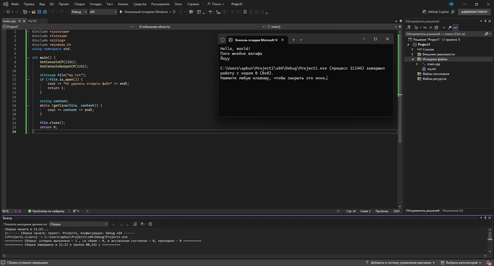
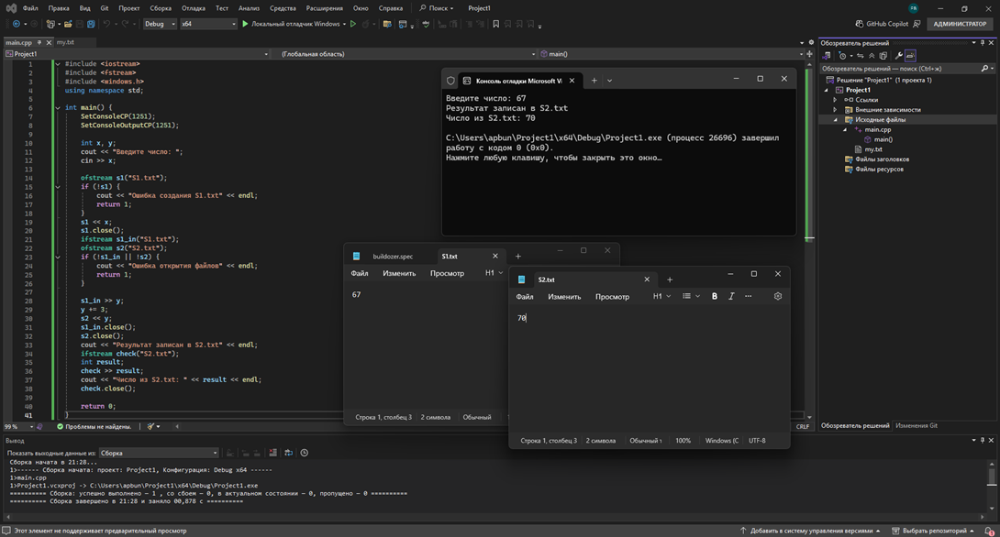
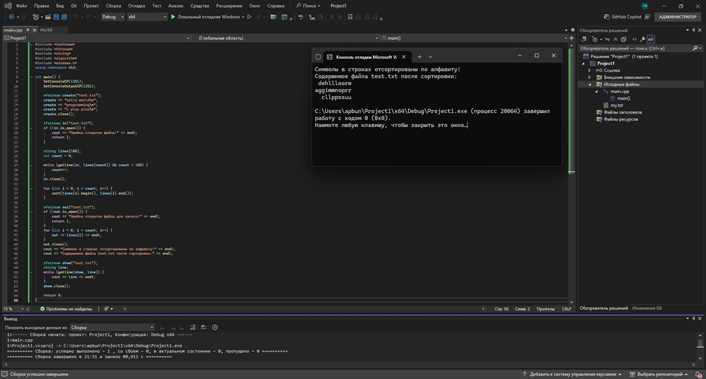
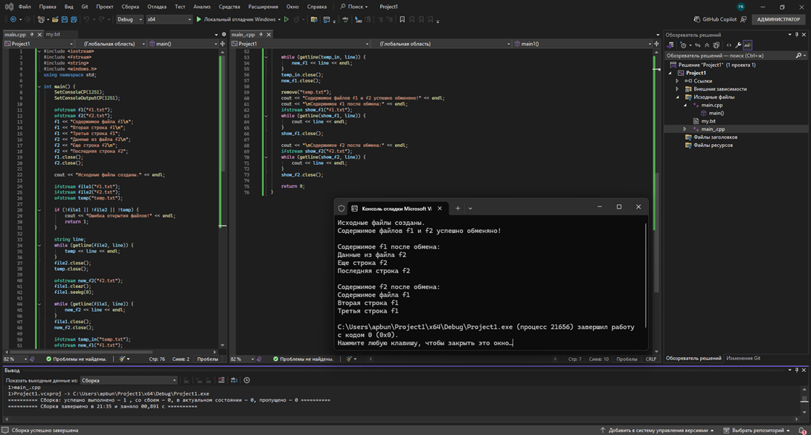
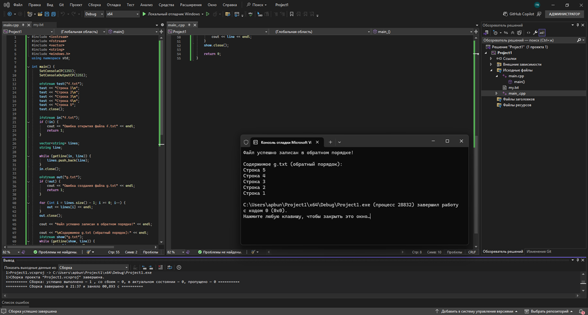
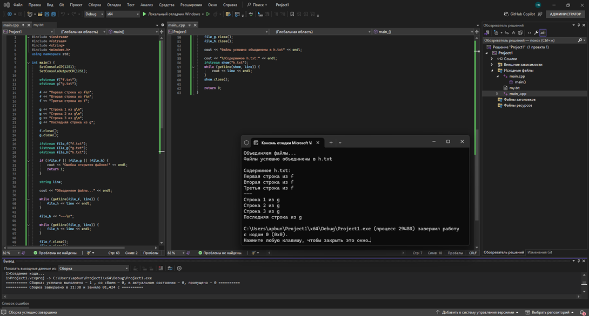
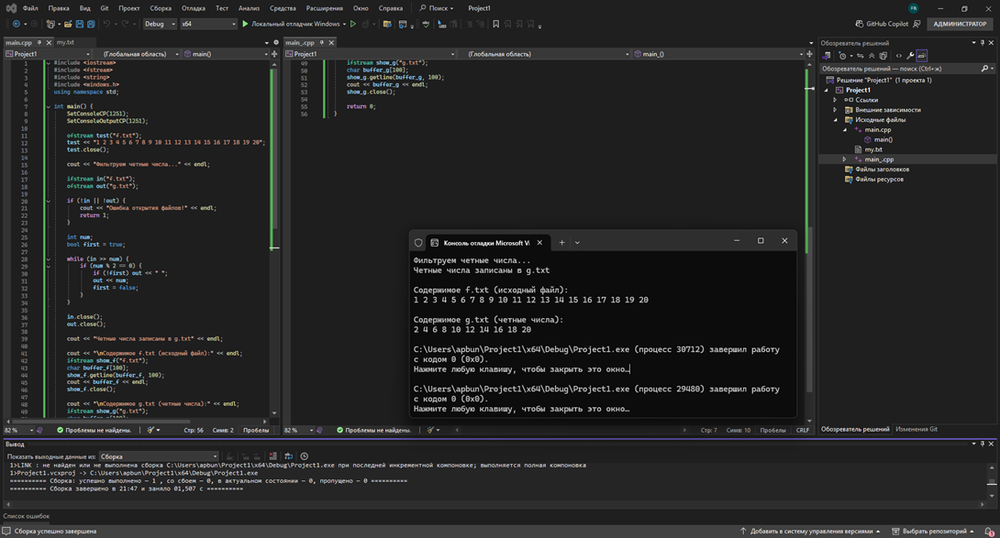
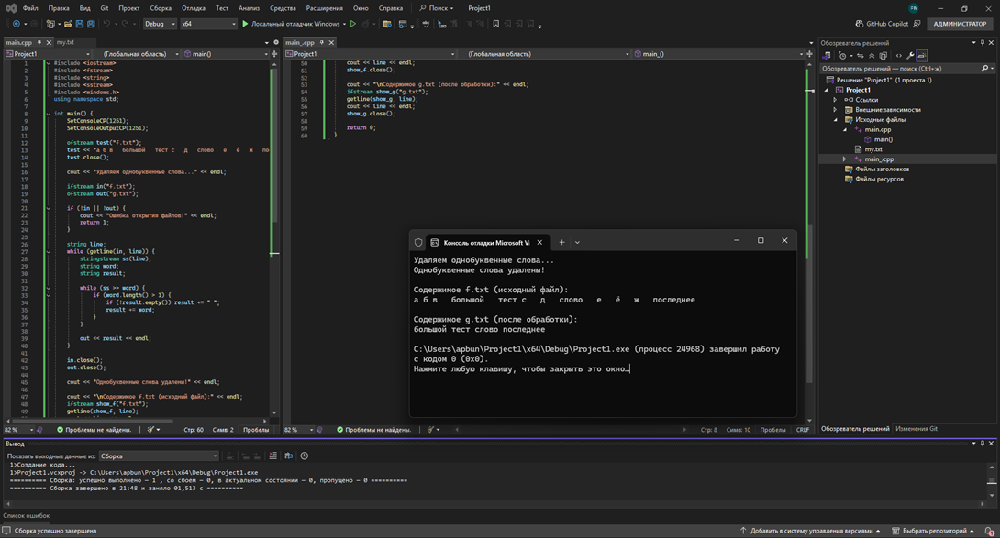
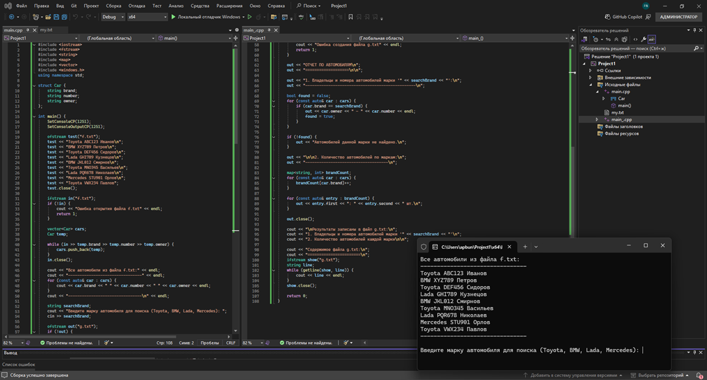

# Файлы последовательного доступа (Практическая работа №2)

Практическая работа №2 по дисциплине "Основы алгоритмизации и программирования".

---

## 📌 Описание

В данной практической работе изучаются основные принципы работы с файлами последовательного доступа, типизированными и нетипизированными файлами. Рассматриваются операции открытия, чтения, записи и закрытия файлов, обработка текстовых и бинарных данных, а также работа со структурированными данными.

---

## ⚙️ Функциональность

- Открытие, чтение и запись файлов в различных режимах
- Обработка текстовых и числовых данных из файлов
- Сортировка символов в строках файла
- Обмен содержимым между файлами
- Чтение файла в обратном порядке
- Объединение содержимого двух файлов
- Фильтрация четных чисел
- Удаление однобуквенных слов из текста
- Работа со структурой «Автомобиль» (типизированный файл)

---

## 💻 Практическая часть

### Задание 1.1. Базовое открытие и закрытие файла

**Постановка задачи:**
Создать программу для базового открытия и закрытия текстового файла с проверкой успешности операции.

**Решение:**
Программа пытается открыть файл для чтения, проверяет успешность открытия и закрывает файл после использования.

**Результат выполнения:**

---

### Задание 1.2. Работа с числами в файлах

**Постановка задачи:**
Создать файл с целыми числами, прочитать их, вычислить сумму и среднее арифметическое.

**Решение:**
Программа записывает несколько чисел в файл, затем считывает их, вычисляя сумму и среднее значение.

**Результат выполнения:**

---

### Задание 1.3. Сортировка символов в строках файла

**Постановка задачи:**
Прочитать строки из файла, отсортировать символы в каждой строке по алфавиту и сохранить результат в новый файл.

**Решение:**
Программа построчно читает исходный файл, для каждой строки сортирует символы методом пузырька и записывает преобразованные строки в выходной файл.

**Результат выполнения:**

---

### Задание 2.1. Обмен содержимым файлов

**Постановка задачи:**
Поменять местами содержимое двух текстовых файлов.

**Решение:**
Программа создает временный файл, копирует в него содержимое первого файла, затем заменяет содержимое первого файла содержимым второго и записывает временные данные во второй файл.

**Результат выполнения:**

---

### Задание 2.2. Файл в обратном порядке

**Постановка задачи:**
Прочитать файл и записать его содержимое в новый файл в обратном порядке (символы в обратной последовательности).

**Решение:**
Программа считывает все содержимое файла в буфер, затем записывает символы в обратном порядке в выходной файл.

**Результат выполнения:**

---

### Задание 2.3. Объединение двух файлов

**Постановка задачи:**
Объединить содержимое двух текстовых файлов в третий файл.

**Решение:**
Программа последовательно читает содержимое первого и второго файлов и записывает их в третий файл (сначала содержимое первого, затем второго).

**Результат выполнения:**

---

### Задание 2.4. Фильтрация четных чисел

**Постановка задачи:**
Из файла с целыми числами выбрать только четные числа и записать их в новый файл.

**Решение:**
Программа читает числа из исходного файла, проверяет каждое число на четность (остаток от деления на 2 равен 0) и записывает четные числа в выходной файл.

**Результат выполнения:**

---

### Задание 2.5. Удаление однобуквенных слов

**Постановка задачи:**
Из текстового файла удалить все слова, состоящие из одной буквы (предлоги, союзы и т.д.).

**Решение:**
Программа читает текст, разбивает его на слова, проверяет длину каждого слова и записывает в выходной файл только слова длиной более одного символа.

**Результат выполнения:**

---

### Задание 2.6. Работа со структурой «Автомобиль»

**Постановка задачи:**
Создать типизированный файл для хранения структуры «Автомобиль» (марка, год выпуска, цена). Реализовать добавление записей и вывод всех записей из файла.

**Решение:**
Программа определяет структуру Car с полями brand, year, price. Реализованы функции добавления новой записи в файл и чтения/вывода всех записей.

**Результат выполнения:**

---

## 💻 Технологии

- Язык программирования: C++
- Среда разработки: (указать используемую среду, например Visual Studio / Code::Blocks и т.д.)
- Библиотеки: `<fstream>`, `<iostream>`, `<string>`, `<vector>`, `<algorithm>`

## 🎯 Цель работы

Изучение основных принципов работы с файлами последовательного доступа, типизированными и нетипизированными файлами, приобретение навыков обработки различных типов данных, хранящихся в файлах.

---

## 🔧 Возможности программы

- ✅ Корректное открытие и закрытие файлов
- ✅ Обработка ошибок при работе с файлами
- ✅ Работа с текстовыми и бинарными данными
- ✅ Обработка структурированных данных
- ✅ Фильтрация и преобразование данных

---

**Автор:** ***

**Дата:** 2026