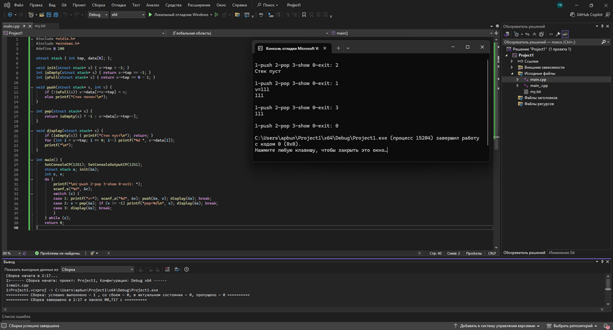
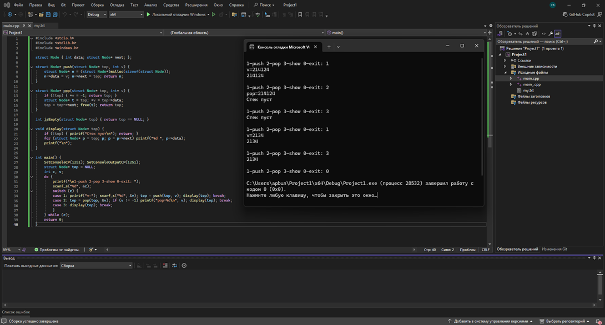
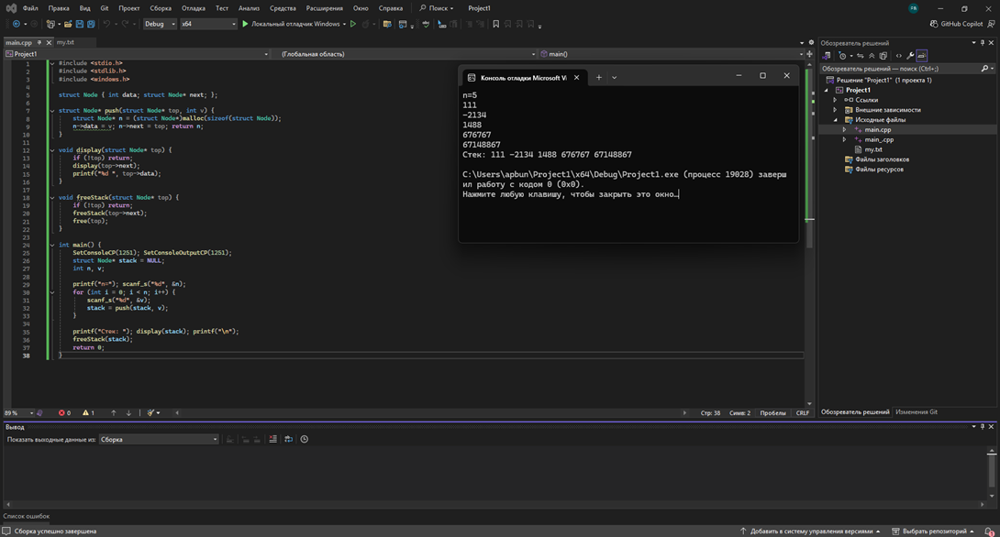
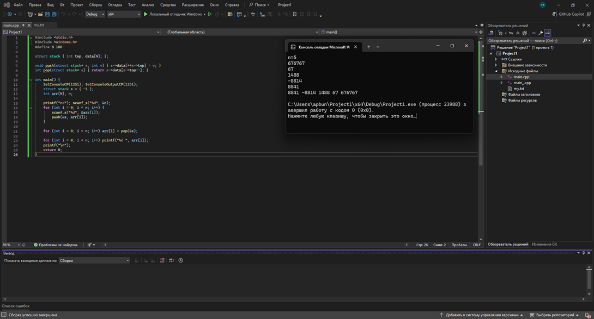
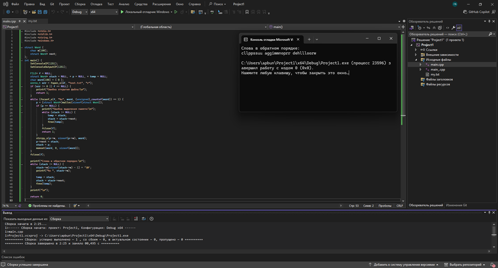
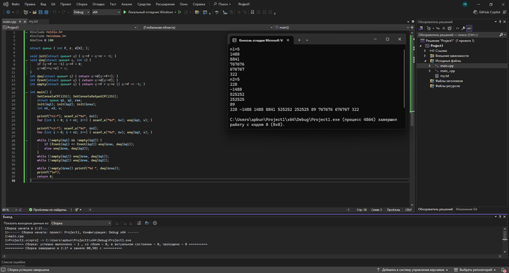

# Структуры данных: стек, очередь, дек (Практическая работа №3)

Практическая работа №3 по дисциплине "Основы алгоритмизации и программирования".

---

## 📌 Описание

В данной практической работе изучаются основные линейные структуры данных: стек, очередь и дек. Рассматриваются принципы их работы, способы реализации (статическая и динамическая), а также основные операции над элементами этих структур.

---

## ⚙️ Функциональность

- Реализация стека на статическом массиве
- Реализация стека на динамическом списке
- Выбор элемента из стека без удаления
- Переворот массива с использованием стека
- Вывод слов в обратном порядке
- Обработка очереди до четного элемента
- Слияние двух очередей
- Работа с файлами и числовыми данными

---

## 💻 Практическая часть

### Задание 1.1. Основные операции над стеками (статический стек)

**Постановка задачи:**
Реализовать стек на основе статического массива. Выполнить основные операции: добавление элемента (push), удаление элемента (pop), просмотр вершины (top), проверка на пустоту (isEmpty) и полноту (isFull).

**Решение:**
Создан класс StaticStack с фиксированным размером массива и указателем вершины. Реализованы все основные операции, выполнено тестирование с выводом результатов.

**Результат выполнения:**

---

### Задание 1.2. Основные операции над стеками (динамический стек)

**Постановка задачи:**
Реализовать стек на основе динамического списка (односвязный список). Выполнить основные операции: добавление элемента (push), удаление элемента (pop), просмотр вершины (top), проверка на пустоту (isEmpty).

**Решение:**
Создан класс DynamicStack с использованием структуры Node (узел списка). Память выделяется динамически, стек может расти до исчерпания памяти.

**Результат выполнения:**

---

### Задание 2. Стек с выбором без удаления

**Постановка задачи:**
Реализовать операцию, которая позволяет получить значение элемента из стека по его порядковому номеру от вершины (например, второй элемент сверху) без удаления этого элемента.

**Решение:**
Создана функция peekAt(stack, position), которая проходит по стеку от вершины на заданное количество шагов и возвращает значение элемента, не изменяя сам стек.

**Результат выполнения:**

---

### Задание 3. Переворот массива

**Постановка задачи:**
Используя стек, перевернуть массив целых чисел (первый элемент становится последним, второй — предпоследним и т.д.).

**Решение:**
Все элементы исходного массива последовательно помещаются в стек, а затем извлекаются обратно в массив. Благодаря принципу LIFO элементы записываются в обратном порядке.

**Результат выполнения:**

---

### Задание 4. Слова в обратном порядке

**Постановка задачи:**
Дана строка, содержащая слова, разделенные пробелами. Используя стек, вывести слова в обратном порядке.

**Решение:**
Строка разбивается на отдельные слова, каждое слово помещается в стек. Затем слова извлекаются из стека и выводятся — получается обратный порядок.

**Результат выполнения:**

---

### Задание 5. Очередь до четного элемента

**Постановка задачи:**
Дана очередь целых чисел. Удалить из очереди все элементы, стоящие до первого четного элемента (сам четный элемент остается).

**Решение:**
Программа извлекает элементы из очереди до тех пор, пока не встретит четное число. Все извлеченные элементы удаляются, а четное число и последующие элементы остаются в очереди.

**Результат выполнения:**

---

### Задание 6-7. Слияние очередей

**Постановка задачи:**
Даны две очереди. Объединить их в третью очередь таким образом, чтобы элементы чередовались: сначала элемент из первой очереди, затем из второй, затем снова из первой и т.д. Если одна очередь закончится раньше, добавить оставшиеся элементы из другой очереди.

**Решение:**
Создана функция mergeQueues, которая поочередно берет элементы из двух исходных очередей и помещает их в результирующую очередь. Реализована обработка случаев разной длины очередей.

**Результат выполнения:**

---

### Задание 8. Файл и число C

**Постановка задачи:**
Дан файл с целыми числами и некоторое число C. Используя дек, переписать в новый файл все числа из исходного файла, которые больше C, в обратном порядке.

**Решение:**
Числа из файла считываются, сравниваются с C. Если число больше C, оно добавляется в начало дека (чтобы обеспечить обратный порядок при извлечении). Затем элементы извлекаются из дека и записываются в выходной файл.

**Результат выполнения:**

---

## 💻 Технологии

- Язык программирования: C++
- Среда разработки: (указать используемую среду, например Visual Studio / Code::Blocks и т.д.)
- Библиотеки: `<iostream>`, `<fstream>`, `<string>`, `<sstream>`

## 🎯 Цель работы

Изучение основных линейных структур данных (стек, очередь, дек), приобретение навыков их реализации и применения для решения практических задач.

---

## 🔧 Возможности программы

- ✅ Реализация статических и динамических структур данных
- ✅ Выполнение основных операций (push, pop, top, isEmpty)
- ✅ Работа с различными типами данных (числа, строки)
- ✅ Взаимодействие с файловой системой
- ✅ Корректная обработка граничных случаев

---

**Автор:** ***

**Дата:** 2026