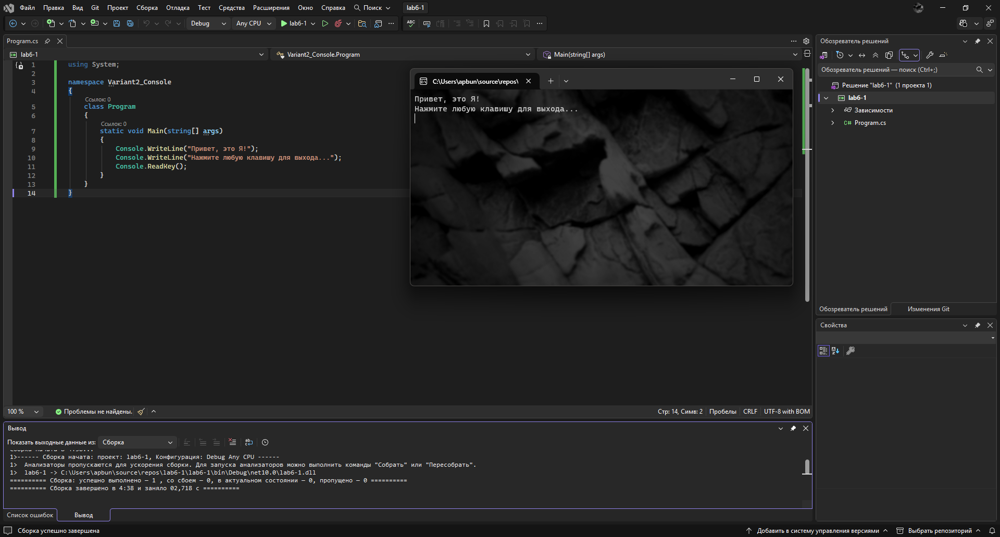
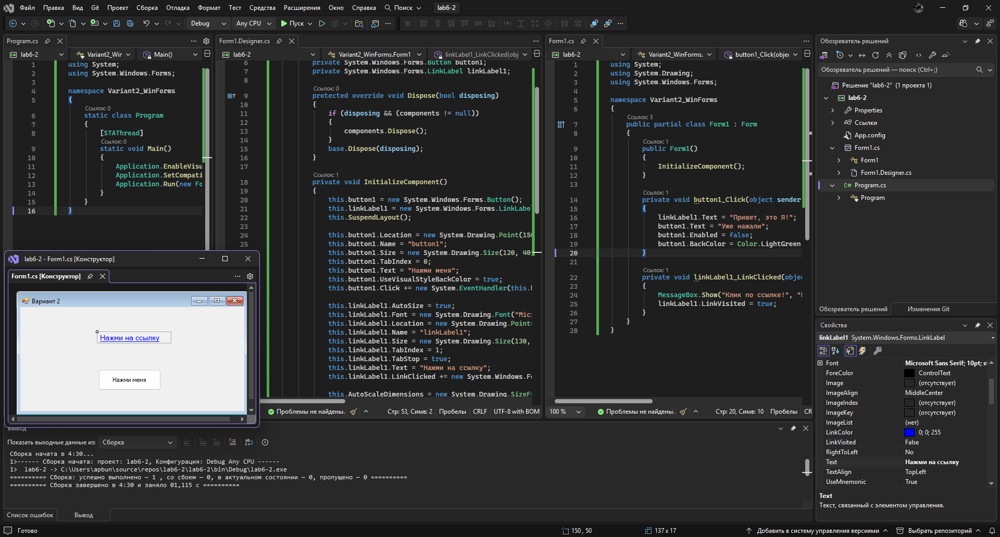
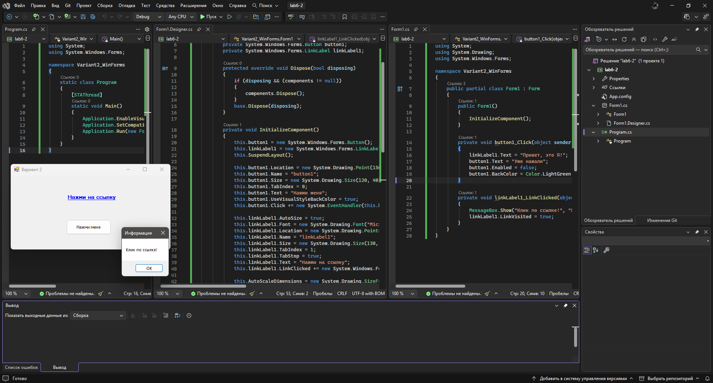
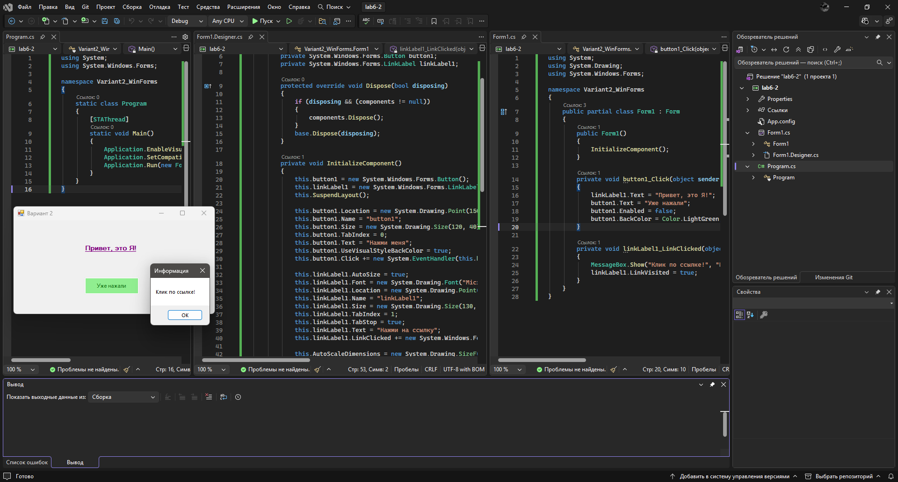

# Разработка приложений на C# в Visual Studio (Практическая работа №6)

Практическая работа №6 по дисциплине "Основы алгоритмизации и программирования".

**Вариант 2**: Текст "Привет, это Я!" + Кнопка (Button) + Гиперссылка (LinkLabel)

---

## 📌 Описание

В данной практической работе изучаются основы разработки приложений на языке C# в интегрированной среде разработки Microsoft Visual Studio. Рассматриваются типы проектов (консольные приложения и Windows Forms), работа с элементами управления, обработка событий и изменение свойств объектов.

Согласно варианту 2, необходимо разработать программу, которая выводит текст "Привет, это Я!" с использованием двух управляющих элементов:

- **Кнопка (Button)** - для программирования события
- **Гиперссылка (LinkLabel)** - для изменения свойств при отображении

---

## ⚙️ Функциональность

- Создание консольного приложения с выводом текста
- Создание Windows Forms приложения с графическим интерфейсом
- Работа с элементами управления: Button и LinkLabel
- Обработка события Click для кнопки
- Настройка свойств LinkLabel (цвет, шрифт, поведение при наведении)
- Программное изменение свойств элементов во время выполнения
- Информационные сообщения для обратной связи с пользователем

---

## 💻 Практическая часть

### Задание 1. Консольное приложение

**Постановка задачи:**

Создать консольное приложение, которое выводит на экран строку "Привет, это Я!" и ожидает нажатия любой клавиши для завершения.

**Код программы (Program.cs):**

```csharp
using System;

namespace Variant2_Console
{
    class Program
    {
        static void Main(string[] args)
        {
            Console.WriteLine("Привет, это Я!");
            Console.WriteLine("Нажмите любую клавишу для выхода...");
            Console.ReadKey();
        }
    }
}
```

**Результат выполнения:**



---

### Задание 2. Windows Forms приложение

**Постановка задачи:**

Создать Windows Forms приложение с кнопкой (Button) и гиперссылкой (LinkLabel). При нажатии на кнопку текст гиперссылки должен меняться на "Привет, это Я!". Также необходимо изменить свойства гиперссылки при отображении (цвет, шрифт, поведение при наведении).

**Код программы (Form1.cs):**

```csharp
using System;
using System.Drawing;
using System.Windows.Forms;

namespace Variant2_WinForms
{
    public partial class Form1 : Form
    {
        public Form1()
        {
            InitializeComponent();
        }

        private void button1_Click(object sender, EventArgs e)
        {
            linkLabel1.Text = "Привет, это Я!";
            button1.Text = "Уже нажали";
            button1.Enabled = false;
            button1.BackColor = Color.LightGreen;
        }

        private void linkLabel1_LinkClicked(object sender, LinkLabelLinkClickedEventArgs e)
        {
            MessageBox.Show("Клик по ссылке!", "Информация");
            linkLabel1.LinkVisited = true;
        }
    }
}
```

**Код программы (Form1.Designer.cs):**

```csharp
namespace Variant2_WinForms
{
    partial class Form1
    {
        private System.ComponentModel.IContainer components = null;
        private System.Windows.Forms.Button button1;
        private System.Windows.Forms.LinkLabel linkLabel1;

        protected override void Dispose(bool disposing)
        {
            if (disposing && (components != null))
            {
                components.Dispose();
            }
            base.Dispose(disposing);
        }

        private void InitializeComponent()
        {
            this.button1 = new System.Windows.Forms.Button();
            this.linkLabel1 = new System.Windows.Forms.LinkLabel();
            this.SuspendLayout();

            this.button1.Location = new System.Drawing.Point(150, 120);
            this.button1.Name = "button1";
            this.button1.Size = new System.Drawing.Size(120, 40);
            this.button1.TabIndex = 0;
            this.button1.Text = "Нажми меня";
            this.button1.UseVisualStyleBackColor = true;
            this.button1.Click += new System.EventHandler(this.button1_Click);

            this.linkLabel1.AutoSize = true;
            this.linkLabel1.Font = new System.Drawing.Font("Microsoft Sans Serif", 10F, System.Drawing.FontStyle.Bold);
            this.linkLabel1.Location = new System.Drawing.Point(150, 50);
            this.linkLabel1.Name = "linkLabel1";
            this.linkLabel1.Size = new System.Drawing.Size(130, 17);
            this.linkLabel1.TabIndex = 1;
            this.linkLabel1.TabStop = true;
            this.linkLabel1.Text = "Нажми на ссылку";
            this.linkLabel1.LinkClicked += new System.Windows.Forms.LinkLabelLinkClickedEventHandler(this.linkLabel1_LinkClicked);

            this.AutoScaleDimensions = new System.Drawing.SizeF(6F, 13F);
            this.AutoScaleMode = System.Windows.Forms.AutoScaleMode.Font;
            this.ClientSize = new System.Drawing.Size(430, 200);
            this.Controls.Add(this.linkLabel1);
            this.Controls.Add(this.button1);
            this.Name = "Form1";
            this.Text = "Вариант 2";
            this.ResumeLayout(false);
            this.PerformLayout();
        }
    }
}
```

**Код программы (Program.cs):**

```csharp
using System;
using System.Windows.Forms;

namespace Variant2_WinForms
{
    static class Program
    {
        [STAThread]
        static void Main()
        {
            Application.EnableVisualStyles();
            Application.SetCompatibleTextRenderingDefault(false);
            Application.Run(new Form1());
        }
    }
}
```

**Результаты выполнения:**

При начальном запуске:



При нажатии на ссылку:



При нажатии на кнопку + второе нажатие на ссылку:



---

## 💻 Технологии

- Язык программирования: C#
- Среда разработки: Visual Studio
- Платформа: .NET Framework 4.7.2
- Библиотеки: `System.Windows.Forms`, `System.Drawing`

## 🎯 Цель работы

Ознакомление с интерфейсом и освоение инструментальных средств и технологии создания прикладных программ с использованием интегрированной среды разработки программного обеспечения Microsoft Visual Studio.

---

## 🔧 Возможности программы

- ✅ Создание консольного приложения с выводом текста
- ✅ Создание Windows Forms приложения с графическим интерфейсом
- ✅ Работа с кнопкой (Button) и гиперссылкой (LinkLabel)
- ✅ Обработка события Click для кнопки
- ✅ Изменение свойств LinkLabel (цвет, шрифт, поведение)
- ✅ Программное изменение свойств элементов во время выполнения
- ✅ Информационные сообщения для обратной связи с пользователем

---

**Автор:** ***

**Дата:** 2026

